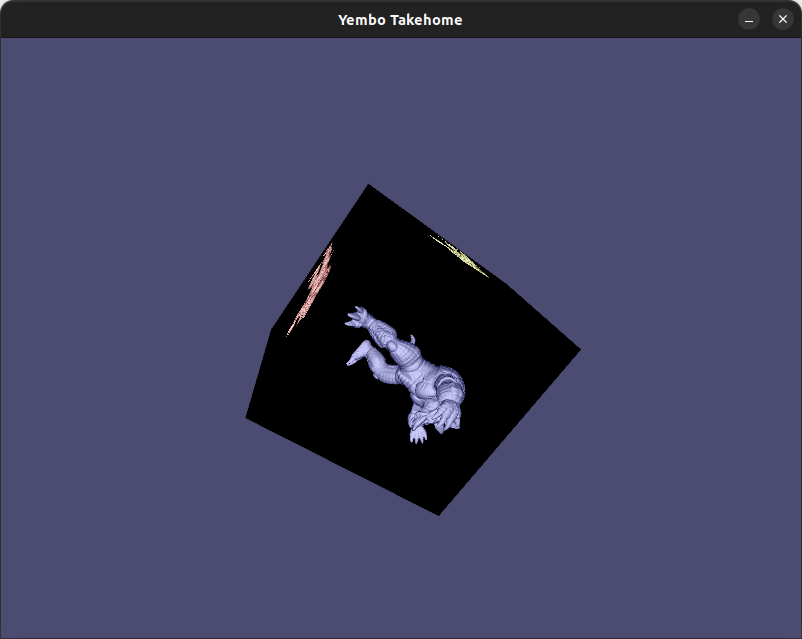

# 3D Graphics Engineer

Thank you for applying for the 3D Graphics Engineer role at Yembo!

As part of our interview process, we ask all candidates to complete this 
take-home assessment. The goal of this assessment is to evaluate a candidate's 
comprehension of fundamental principles in 3D graphics, as well as their 
programming ability.

## Objectives
In this takehome you will be asked to modify the given takehome.c file to go
from a simple "Hello, Triangle!" application to an application that is going to
look something like this:



Do not feel like you need to reproduce this image exactly, feel free to be creative!


Below are the tasks for you:
1. Render armadillo model (check the print statements!) with phong shading to an offscreen texture
    - It is fine to skip the specular component and only do ambient and diffuse. 
      If you want to be creative, you can implement fancier BRDFs, and tell us about
      them in your writeup!
    - Armadillo should slowly rotate around x axis.

2. Render cube instead of triangle
    - store position, vertex color and uv coordinates per vertex.
    - cube should be rotating slowly around `[0.7071068, 0.7071068, 0.0]` (normalized `[1.0, 1.0, 0.0]`)
      Helpful function here is `mat4_make_rotation`. Angle is specified in radians!
    - At each face you should be displaying the offscreen armadillo as a texture

3. Provide short writeup showing the screenshots of your solution and any challanges
  that you found along the way

### Deliverables

1. Modifed takehome.c file
2. A `solution.pdf` file with the screeshots of your solution and explanatio of
how you approached the problem.

### TIPS
- Remember to set the rasterizer state correctly!
- `gl_helpers.h` includes code that will make shader compilation a bit simpler, but feel free to use your own code if you so choose.
- `vec_math.h` includes a lot of code that you can find in libraries like `glm`. 
  We provide functions like `perspective` and `look_at` to generate projection and view matrices.
- A mathematical formula multiplying to matrices `C=AB` is written as:
```
mat4_t C = mat4_mul(A,B);
```
- All math functions that take angles assume radians! We provide `deg2rad` and `rad2deg` functions.
- To upload matrix as uniforms to glsl, you need to take `.data` element of a matrix.
and cast it to float. The layout is as glsl expects it.
- Armadillo model is stored in trivial binary format, in big endian. If your machine is somehow little endian, I am very sorry. 
    - first four bytes are the vertex count
    - second four bytes are the triangle count 
    - the next block is `vertex_count` * 6 * sizeof(float)  -> stores positions and normals per vertex
    - the next block is `triangle_count` * 3 * sizeof(uint32_t) -> stores triangle indices

We hope you have fun!

## Compilation
To compile the project you should be able to simply use compiler directly:

**Windows**

On Windows, we assume you have Visual Studio (we tested Visual Studio 2022 Community Edtion), with C/C++ development. You should be able to open `x64 Native Tools Command Prompt for VS 2022` terminal, in which you will have
access to `cl.exe`, the MSVC compiler. Then you can compile the takehome as:
```
cl.exe -nologo -std:c11 takehome_solution.c -Fetakehome.exe -link gdi32.lib user32.lib shell32.lib
```

**Linux**

On Linux, you can use `clang` or `gcc`. We tested the compilation on `Ubuntu 2022.04.4 LTS` 
```
gcc -Wall -std=c11 takehome.c -o takehome.exe -lm -lrt
```
or

```
clang -Wall -std=c11 takehome.c -o takehome.exe -lm -lrt
```
If that does not work, check the [GLFW compile guide](https://www.glfw.org/docs/latest/compile_guide.html), specifically you might need 
to install:
```
sudo apt install libwayland-dev libxkbcommon-dev xorg-dev
```

**macOS**

On macOS we tested the code on `Sonoma 14.5` and `Apple clang version 15.0.0`. We needed to silence some warnings 
as Apple is much more agressive about deprecating code
```
clang -Wall -Wno-deprecated-declarations -ObjC takehome.c -o takehome.exe -framework Cocoa -framework IOkit
```

## FAQ
- What is this `#define XX_IMPLEMENTATION` bussiness?

     Single header library concept (afaik) was introduced by Sean T. Barret with
     his stb libraries. For this takehome the benefit of being able to compile
     the code with a single call to C compiler outweights the drawbacks of this
     approach. We can't make assumpitons on candidate's IDE / OS, but we 
     expect everyone to have `MSVC`, `clang` or `gcc` 

- OpenGL?! Have you not heard about Vulkan/DX12/Metal ??!

     We are as excited as you are about modern graphics APIs, however with
     this takehome we mainly want to assess if you are aware of some basic 
     computer graphics concept, and OpenGL is sufficient for this.
     Secondly, OpenGL (at 4.1) is still the only major graphics API that can
     be build on Windows, Linux, and Mac. Since we do not want to require 
     specific OS from our candidates, OpenGL it is

- C?? Its 2024, C++ is the standard!

     Again, this is just a simple application and C seems sufficient here.
     If you are really missing features like operator overloading for matrix 
     and vector operations, feel free to implement them in "vec_math.h", or use some other library like glm. However, you need to make sure that we still can easily compile your solution.

# Copyright Notice
Copyright © 2023 Yembo, Inc. All rights reserved. This source code and data is confidential and proprietary and may not be used or distributed without the written permission of Yembo, Inc.
